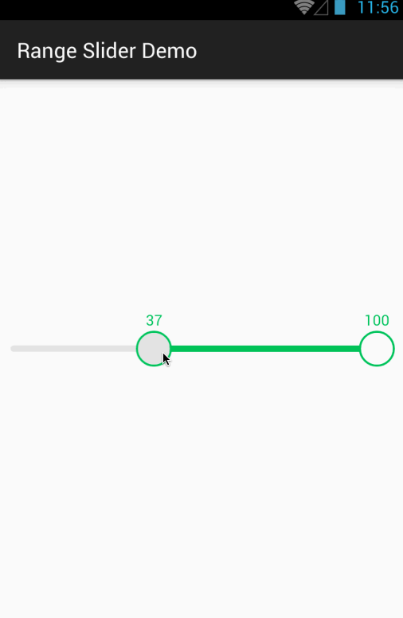

# range-slider
Android range slider library.

# Screenshot



# Setup

* In your `build.gradle` :

```gradle
repositories {
    maven { url "https://jitpack.io" }
}

dependencies {
    compile 'com.github.nanjingboy:range-slider:1.0'
}
```

* [Sample](sample/src/main)

# API

* `public void setOnValueChangedListener(OnValueChangedListener onValueChangedListener)`
* `public void setRangeValues(ArrayList<Integer> values)`
* `public void setMinAndMaxValue(int minValue, int maxValue)`

# License

MIT